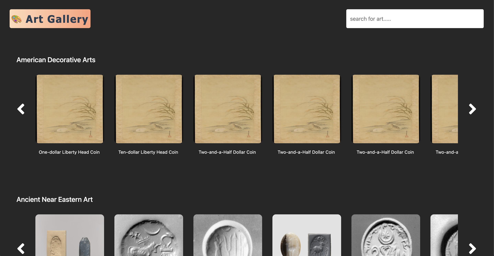

# Art Gallery (Angular)

 - `Live` : https://shubhamshekhar23.github.io/Art-Gallery-Angular/

## Project Features

- When the app loads, It makes backend request and loads the art listing of department sequentially. So, first the art content of departemnt 1 loads and then department2 and so on.
- For performance improvement, the app loads only the first 13 artlisting of each department and as user clicks on the right button, it will load the next 13 and so on.
- debouncing feature is implemented on search input, when user searches for a text, then it follows the same process as described above. It loads the content one by one
- In the main page, low resolution image is selected, But some data doesn't have images. So, a default one is chosen.
- After clicking on the image title, app opens a modal showing a high resolution image and details of the art form
- App is completely responsive and be easily used until 320px device width
- fontawesome and bootstrap has been used in the app
- The backend api used is `https://collectionapi.metmuseum.org/public/collection/v1` from `https://metmuseum.github.io/`

## Run this app

- Run `npm i` and then `npm run start`
- Navigate to `http://localhost:4200/`
